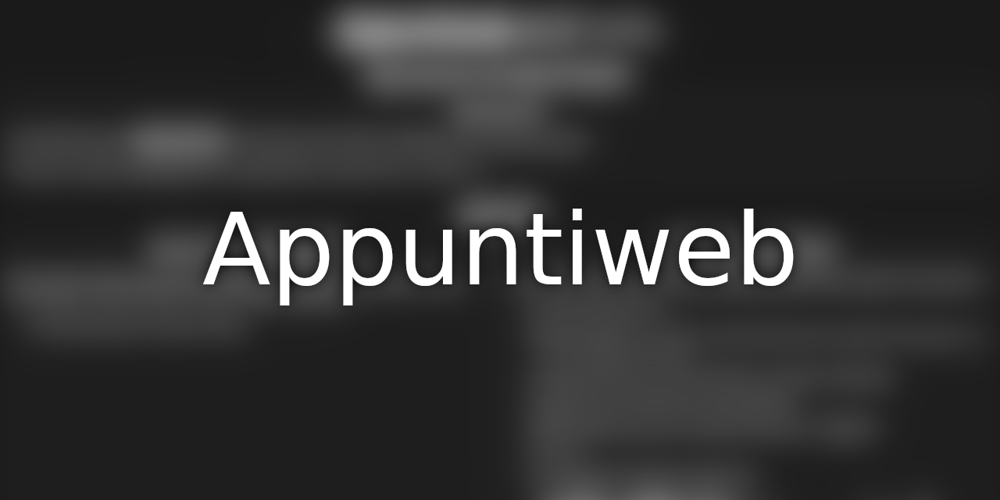

# 

A [Preact](https://preactjs.com/) website with all things I'm using to prepare for university exams!

## Contributing

All contributions are welcome!

Please help me making this an useful resource to all students everywhere, and correct mistakes if you find them! :D

## Developing

### Running a local copy

If you want to run a local copy of the website, ensure [the latest `nodejs`](https://nodejs.org/it/) and `npm` are installed on your machine then run:

```bash
git clone https://github.com/Steffo99/appuntiweb.git
cd appuntiweb
npm install --dev
npm run start
```

### Updating the website

To update the published website, just push the commit to the `main` branch.

[Render](https://render.com/) will do the rest.
